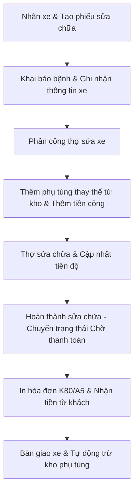

# 🛠️ Dịch Vụ Sửa Chữa (Quản Lý Xưởng Sửa Xe)

**Đường dẫn truy cập:** `/service` và `/service-history`  
**Đối tượng sử dụng chính:** `owner` (Chủ), `manager` (Quản lý), `staff` (Cố vấn dịch vụ / Thợ sửa xe)

---

## 1. Tổng Quan Chức Năng
Đây là module cốt lõi của **Motocare**, phục vụ trực tiếp cho quy trình tiếp nhận, sửa chữa, bảo dưỡng phương tiện và bàn giao xe cho khách hàng. Hệ thống giúp số hóa toàn bộ quy trình làm việc của thợ, tự động hóa việc xuất phụ tùng từ kho và hỗ trợ tra cứu lịch sử sửa xe một cách nhanh chóng.

---

## 2. Nhiệm Vụ & Tính Năng Chính

### A. Quản Lý Phiếu Sửa Chữa (Work Orders / Service Receipts)
*   **Tiếp nhận phương tiện:** Tạo phiếu mới khi khách mang xe đến tiệm. Ghi nhận biển số xe, thông tin khách hàng, số km (odo), triệu chứng xe (bệnh xe) và các yêu cầu sửa chữa cụ thể.
*   **Phân công kỹ thuật viên (Thợ):** Chọn thợ chính và thợ phụ đảm nhận sửa chữa cho từng xe hoặc từng hạng mục công việc cụ thể. Hệ thống sẽ lấy dữ liệu này để tính hoa hồng thợ vào cuối tháng.
*   **Khai báo phụ tùng & Dịch vụ:**
    *   **Phụ tùng thay thế:** Chọn từ danh sách kho. Hệ thống tự động kiểm tra số lượng tồn, hiển thị giá bán và ghi nhận xuất kho khi hoàn thành phiếu.
    *   **Tiền công sửa chữa:** Chọn các dịch vụ kỹ thuật (ví dụ: công vá lốp, công rã máy, vệ sinh buồng đốt) với giá dịch vụ đã được định nghĩa hoặc nhập thủ công.
*   **Trạng thái phiếu sửa chữa:**
    1.  `Chờ làm` (Pending): Xe đã được tiếp nhận và đang chờ thợ trống bàn nâng để thực hiện.
    2.  `Đang sửa` (In Progress): Thợ đang thực hiện sửa chữa và lắp ráp phụ tùng.
    3.  `Chờ thanh toán` (Completed - Unpaid): Đã sửa xong, đang chờ khách hàng nghiệm thu và làm thủ tục thanh toán tại quầy.
    4.  `Đã hoàn thành` (Settled): Khách hàng đã thanh toán hóa đơn thành công, xe được bàn giao.

### B. Tra Cứu Lịch Sử Sửa Chữa (Service History)
*   **Tìm kiếm thông minh:** Cho phép nhập Biển số xe, Số điện thoại hoặc Tên khách hàng để tìm lại toàn bộ lịch sử các lần sửa xe trước đó.
*   **Thông tin hiển thị:** Xem ngày sửa chữa, những bộ phận đã thay thế, thợ nào đã làm, giá tiền và các ghi chú kỹ thuật đi kèm (ví dụ: "chén cổ sắp hỏng, khách chưa chịu thay").

---

## 3. Quy Trình Nghiệp Vụ Tiêu Chuẩn (Workflow)

---

## 4. Lưu Ý Quan Trọng
*   **Trừ kho phụ tùng:** Số lượng tồn kho của phụ tùng chỉ được trừ thực tế sau khi phiếu sửa chữa chuyển sang trạng thái **Đã hoàn thành (Settled)** hoặc **Chờ thanh toán (Unpaid)** (tùy thuộc vào cấu hình hệ thống). Cần hoàn thành phiếu đúng hạn để số liệu tồn kho luôn chính xác.
*   **Hoa hồng thợ:** Hoa hồng thợ được tính toán dựa trên việc chọn đúng tên thợ trong phần thông tin chi tiết dịch vụ/phụ tùng của phiếu sửa chữa. Nếu không gán tên thợ, hệ thống không thể tính hoa hồng cho nhân viên đó.
*   **Thẻ bảo hành:** Khi hóa đơn sửa chữa hoàn thành, hệ thống sẽ tự động kích hoạt bảo hành cho các phụ tùng có chế độ bảo hành dựa trên ngày xuất hóa đơn.
