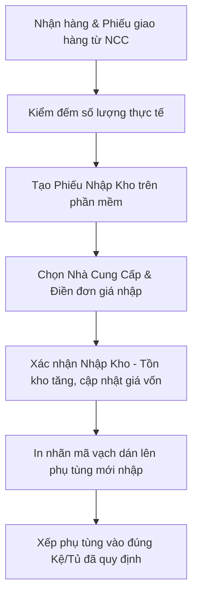

# 📦 Quản Lý Kho & Tồn Kho Phụ Tùng

**Đường dẫn truy cập:** `/inventory`  
**Đối tượng sử dụng chính:** `owner` (Chủ cửa hàng), `manager` (Quản lý kho/chi nhánh)

---

## 1. Tổng Quan Chức Năng
Kho hàng là tài sản lớn nhất của một cửa hàng sửa chữa xe máy. Module **Quản Lý Kho** giúp kiểm soát chặt chẽ số lượng phụ tùng (lốp, săm, má phanh, dầu nhớt, nhông xích...), quản lý lịch sử xuất nhập kho, tối ưu hóa vốn lưu động bằng cách cảnh báo tồn kho thấp và hỗ trợ dán nhãn mã vạch để tự động hóa khâu bán hàng.

---

## 2. Nhiệm Vụ & Tính Năng Chính

### A. Danh Mục Phụ Tùng (Product Catalog)
*   **Khai báo sản phẩm:** Lưu trữ thông tin chi tiết của từng phụ tùng bao gồm:
    *   Mã sản phẩm (SKU/Barcode) tự sinh hoặc nhập theo mã nhà sản xuất.
    *   Tên phụ tùng, nhóm hàng (dầu nhớt, phụ tùng thay thế, đồ chơi xe...).
    *   Đơn vị tính (Cái, Bộ, Chai, Mét...).
    *   Vị trí kệ kho (ví dụ: Kệ A1, Tủ B) giúp tìm kiếm phụ tùng nhanh chóng trong kho thực tế.
*   **Quản lý giá đa tầng:**
    *   **Giá nhập (Giá vốn):** Giá mua từ nhà cung cấp (hệ thống tự tính giá vốn bình quân gia quyền).
    *   **Giá bán lẻ:** Giá áp dụng cho khách hàng vãng lai.
    *   **Giá thợ:** Giá ưu đãi dành cho thợ ngoài hoặc khách hàng mua sỉ.
*   **Cảnh báo tồn kho tối thiểu:** Thiết lập ngưỡng tồn kho an toàn cho từng phụ tùng. Khi số tồn thực tế thấp hơn ngưỡng này, hệ thống sẽ phát cảnh báo trên Command Center để lên kế hoạch nhập hàng.

### B. Nhập Kho Phụ Tùng (Goods Receipt)
*   **Tạo phiếu nhập kho:** Ghi nhận thông tin nhập hàng từ nhà cung cấp: số lượng, đơn giá nhập thực tế, chiết khấu của nhà cung cấp.
*   **Quản lý Nhà cung cấp (Suppliers):** Lưu thông tin nhà cung cấp phụ tùng, lịch sử nhập hàng và theo dõi công nợ nhà cung cấp (nợ tiền hàng gối đầu).

### C. Lịch Sử Kho (Inventory History / Thẻ Kho)
*   **Ghi nhận biến động:** Lưu lại mọi giao dịch làm thay đổi số lượng tồn kho:
    *   `Nhập kho`: Do tạo phiếu nhập hàng mới.
    *   `Xuất bán lẻ`: Qua hóa đơn POS.
    *   `Xuất sửa chữa`: Qua phiếu sửa chữa dịch vụ.
    *   `Điều chỉnh kho`: Do kiểm kho thực tế và phát hiện lệch, cần cân đối lại dữ liệu.
*   **Đối soát:** Giúp thủ kho đối chiếu nguyên nhân gây thất thoát phụ tùng.

### D. In Nhãn Mã Vạch (Barcode Printing)
*   Cho phép in nhãn mã vạch (Barcode) riêng lẻ hoặc in hàng loạt (Batch Print) theo phiếu nhập kho. Nhãn chứa mã vạch, tên sản phẩm và giá bán lẻ để dán trực tiếp lên phụ tùng.

---

## 3. Quy Trình Nhập Kho Tiêu Chuẩn (Workflow)

---

## 4. Lưu Ý Quan Trọng
*   **Tính giá vốn:** Hệ thống sử dụng phương pháp **Bình quân gia quyền** để tính toán giá vốn của phụ tùng. Khi giá nhập biến động theo từng lô, hệ thống sẽ tự động cập nhật lại giá vốn để tính toán chính xác lợi nhuận gộp ở các đơn bán sau.
*   **Kiểm kho định kỳ:** Nên thực hiện kiểm kho định kỳ (mỗi tháng 1 lần) và sử dụng chức năng "Điều chỉnh kho" để cập nhật số tồn thực tế nhằm phát hiện kịp thời các trường hợp thất thoát hoặc nhầm lẫn phụ tùng.
*   **Import Excel:** Khi bắt đầu sử dụng phần mềm hoặc nhập lô sản phẩm lớn, nên sử dụng chức năng **Import dữ liệu phụ tùng** từ file Excel để tiết kiệm thời gian khai báo thủ công.
