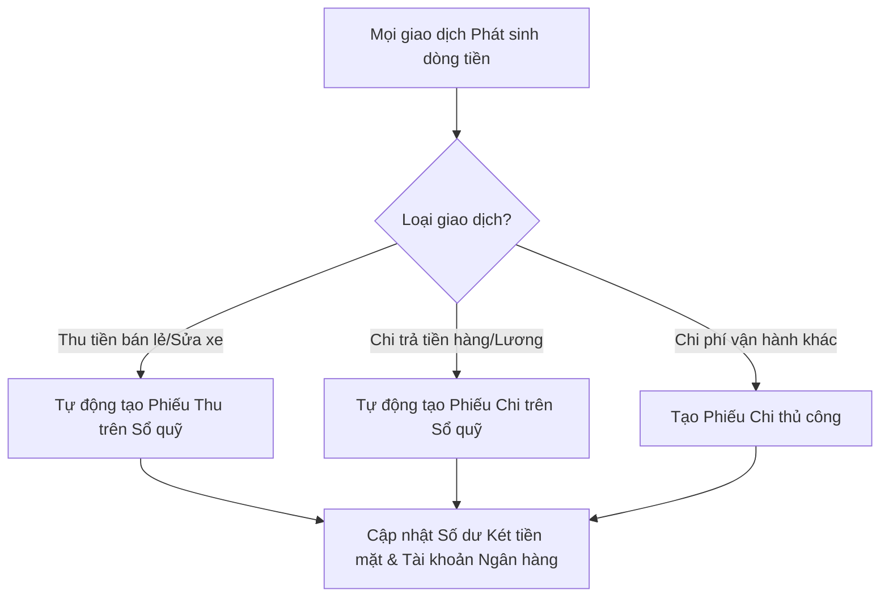

# 🏦 Quản Lý Tài Chính (Sổ Quỹ, Khoản Vay & Tài Sản)

**Đường dẫn truy cập:** `/finance` và `/cashbook` & `/loans`  
**Đối tượng sử dụng chính:** `owner` (Chủ cửa hàng), `manager` (Quản lý tài chính), `accountant` (Kế toán)

---

## 1. Tổng Quan Chức Năng
Module **Quản Lý Tài Chính** là trung tâm kiểm soát dòng tiền mặt, dòng tiền ngân hàng, các khoản nợ vay đầu tư và tài sản cố định của tiệm sửa xe. Module này giúp chủ tiệm kiểm soát chính xác quỹ tiền hiện có, nguồn gốc thu chi, tránh thất thoát tiền bạc và đánh giá đúng hiệu quả đầu tư trang thiết bị.

---

## 2. Nhiệm Vụ & Tính Năng Chính

### A. Sổ Quỹ Thu Chi (Cash Book)
*   **Ghi nhận thu chi tự động:**
    *   **Thu tiền:** Tự động tạo phiếu thu khi hoàn thành hóa đơn bán lẻ POS, hóa đơn sửa xe hoặc ghi nhận thu nợ từ khách hàng.
    *   **Chi tiền:** Tự động tạo phiếu chi khi thanh toán hóa đơn nhập hàng từ nhà cung cấp hoặc chi trả lương nhân viên.
*   **Ghi nhận thu chi thủ công:** Cho phép kế toán tạo phiếu thu/chi cho các hoạt động vận hành thường ngày như: chi tiền điện, nước, internet, chi mua văn phòng phẩm, thu tiền thanh lý đồ cũ...
*   **Quản lý tài khoản thanh toán:** Phân chia dòng tiền rõ ràng giữa **Két tiền mặt** tại quầy và **Tài khoản ngân hàng** của cửa hàng.

### B. Quản Lý Khoản Vay (Loans Manager)
*   **Theo dõi khoản vay:** Ghi nhận các khoản vay phục vụ kinh doanh (vay ngân hàng thương mại, vay người thân, vay tín dụng mua trang thiết bị).
*   **Lịch trả nợ:** Thiết lập lịch trả nợ định kỳ (ngày thanh toán, số tiền gốc phải trả, số tiền lãi phát sinh).
*   **Lịch sử trả nợ:** Ghi nhận thực tế các lần trả nợ gốc và lãi, tự động cập nhật giảm số dư nợ vay và tạo phiếu chi tương ứng trên Sổ quỹ.

### C. Quản Lý Tài Sản Cố Định (Fixed Assets)
*   **Danh sách tài sản:** Khai báo các tài sản lớn của tiệm sửa xe như bàn nâng thủy lực, máy nén khí, máy đọc lỗi chuyên dụng (Smarttool), máy ra vào lốp, máy rửa xe...
*   **Khấu hao tài sản:** Thiết lập thời gian khấu hao (ví dụ: khấu hao trong 3 năm). Hệ thống hỗ trợ tính toán và phân bổ chi phí khấu hao tài sản hàng tháng vào báo cáo tài chính để phản ánh chính xác chi phí hoạt động thực tế.

### D. Quản Lý Nguồn Vốn (Capital)
*   Ghi nhận vốn góp ban đầu và vốn góp bổ sung của các cổ đông/chủ sở hữu tiệm.
*   Phân chia lợi nhuận theo tỷ lệ góp vốn sau khi kết thúc kỳ kế toán.

---

## 3. Quy Trình Nghiệp Vụ Tiêu Chuẩn (Workflow)

---

## 4. Lưu Ý Quan Trọng
*   **Đối soát quỹ cuối ngày:** Thu ngân cần thực hiện kiểm đếm tiền mặt thực tế tại két vào cuối ngày và đối chiếu với số dư Két tiền mặt hiển thị trên Sổ quỹ phần mềm. Bất kỳ khoản chênh lệch nào cần được tìm hiểu nguyên nhân và xử lý ngay.
*   **Phân loại khoản thu/chi (Category):** Khi tạo phiếu thu/chi thủ công, luôn chọn đúng nhóm phân loại (ví dụ: "Chi tiền điện nước", "Chi tiếp khách") để hệ thống có dữ liệu phân tích cơ cấu chi phí chính xác trong module **Phân tích**.
