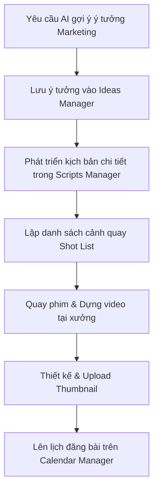

# 📣 Marketing & Trợ Lý AI (Quản Lý Nội Dung & Chiến Dịch)

**Đường dẫn truy cập:** `/marketing`  
**Đối tượng sử dụng chính:** `owner` (Chủ), `manager` (Quản lý / Nhân viên truyền thông)

---

## 1. Tổng Quan Chức Năng
Trong thời đại số, marketing đóng vai trò cốt lõi giúp tiệm sửa xe thu hút khách hàng mới và duy trì tương tác với khách hàng cũ. Module **Marketing & Trợ Lý AI** tích hợp các công nghệ trí tuệ nhân tạo (AI) giúp chủ tiệm lên ý tưởng, viết kịch bản video ngắn (TikTok/Reels/Shorts), lập lịch đăng bài và xây dựng kho tri thức kỹ thuật xe để nâng cao vị thế uy tín cho cửa hàng.

---

## 2. Nhiệm Vụ & Tính Năng Chính

### A. Trợ Lý AI Tư Vấn (AI Advisor & AI Assistant)
*   Sử dụng AI được huấn luyện chuyên biệt về ngành sửa chữa và chăm sóc xe máy.
*   **Chức năng:** Phân tích nhu cầu khách hàng, gợi ý tiêu đề thu hút (clickbait sạch), soạn thảo nội dung bài viết kỹ thuật dễ hiểu cho người dùng phổ thông, hoặc giải đáp các thắc mắc về chiến lược quảng cáo địa phương.

### B. Quản Lý Ý Tưởng & Kịch Bản Video (Ideas & Scripts Manager)
*   **Ideas Manager:** Nơi lưu trữ và phân loại các ý tưởng nội dung thô (ví dụ: "Mẹo đi mưa không lo chết máy SH", "So sánh má phanh chính hãng và má phanh fake").
*   **Scripts Manager:** Soạn thảo kịch bản chi tiết cho video TikTok, YouTube Shorts, Reels bao gồm:
    *   *Tiêu đề kịch bản & Hook (3 giây đầu)* để giữ chân người xem.
    *   *Bảng phân cảnh:* Cột Lời thoại (Voice-over) song song với cột Cảnh quay tương ứng (Visual).
    *   *Shot List:* Danh sách chi tiết các góc máy cần quay tại xưởng (ví dụ: quay cận cảnh tháo ốc nồi, quay biểu cảm thợ).

### C. Quản Lý Ảnh Bìa & Lịch Đăng Bài (Thumbnails & Calendar Manager)
*   **Thumbnails Manager:** Quản lý hình ảnh đại diện của bài đăng hoặc video, hỗ trợ kiểm soát thiết kế đồng bộ nhận diện thương hiệu của tiệm.
*   **Calendar Manager (Lịch Biên Tập):** Giao diện lịch (Calendar) trực quan để kéo-thả, lên kế hoạch phân phối bài viết/video lên các kênh mạng xã hội (Facebook Fanpage, Zalo OA, TikTok, YouTube) theo từng ngày trong tháng.

### D. Hệ Thống Tri Thức Xe Máy (Knowledge Management System - KMS)
*   **KmsArticlesManager:** Xây dựng kho bài viết chia sẻ kinh nghiệm kỹ thuật nội bộ dành cho thợ mới (ví dụ: "Quy trình căn chỉnh xích tải tiêu chuẩn", "Cách đọc mã lỗi trên máy Smarttool").
*   **Chia sẻ khách hàng:** Xuất bản các bài viết cẩm nang hướng dẫn sử dụng xe an toàn ra website công cộng để khách hàng của tiệm tham khảo, nâng cao uy tín thương hiệu Nhạn Lâm SmartCare.

---

## 3. Quy Trình Sản Xuất Nội Dung Tiêu Chuẩn (Workflow)

---

## 4. Lưu Ý Quan Trọng
*   **Tính thực tế của AI:** Nội dung do Trợ lý AI tạo ra cần được thợ kỹ thuật có kinh nghiệm kiểm duyệt lại về mặt chuyên môn xe máy trước khi đăng tải để tránh sai sót kiến thức kỹ thuật.
*   **Bảo mật kịch bản:** Các kịch bản mang tính độc quyền hoặc bí quyết kỹ thuật của tiệm nên được phân quyền lưu hành nội bộ thay vì xuất bản công khai trên hệ thống KMS chia sẻ khách hàng.
*   **Hashtag thông minh:** Tận dụng mục **HashtagsManager** để lưu trữ bộ thẻ hashtag có tương tác cao (như `#suaxemay`, `#smartcare`, `#nhanlammotocare`) để nhân viên tiện sao chép nhanh khi đăng bài.
