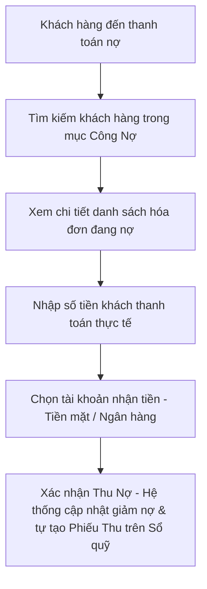

# 💳 Quản Lý Công Nợ Đối Tác (Nợ Khách Hàng & Nhà Cung Cấp)

**Đường dẫn truy cập:** `/debt`  
**Đối tượng sử dụng chính:** `owner` (Chủ cửa hàng), `manager` (Quản lý), `accountant` (Kế toán)

---

## 1. Tổng Quan Chức Năng
Trong kinh doanh sửa chữa xe, việc khách quen nợ tiền sửa xe hoặc cửa hàng mua phụ tùng nợ gối đầu nhà cung cấp là rất phổ biến. Module **Quản Lý Công Nợ** giúp ghi nhận tự động, theo dõi chi tiết lịch sử phát sinh nợ, các đợt trả nợ, cảnh báo nợ xấu quá hạn để đảm bảo an toàn dòng tiền cho cửa hàng.

---

## 2. Nhiệm Vụ & Tính Năng Chính

### A. Quản Lý Nợ Phải Thu (Công Nợ Khách Hàng)
*   **Ghi nhận nợ tự động:** Khi thanh toán phiếu sửa xe hoặc hóa đơn bán hàng POS, nếu chọn hình thức "Ghi nợ", hệ thống sẽ tự động chuyển giá trị hóa đơn (hoặc phần còn thiếu) thành dư nợ phải thu của khách hàng đó.
*   **Chi tiết công nợ:** Theo dõi danh sách khách hàng đang nợ tiền, tổng dư nợ hiện tại của từng người, hạn thanh toán và ghi chú cụ thể.
*   **Ghi nhận Thu nợ:** Khi khách đến trả nợ (trả hết hoặc trả một phần), nhân viên nhập số tiền thu, hệ thống tự động tạo phiếu thu trên Sổ quỹ và giảm dư nợ của khách tương ứng.

### B. Quản Lý Nợ Phải Trả (Công Nợ Nhà Cung Cấp)
*   **Ghi nhận nợ nhập hàng:** Khi tạo phiếu nhập kho phụ tùng từ nhà cung cấp, nếu không thanh toán toàn bộ bằng tiền mặt/chuyển khoản, phần tiền chưa trả sẽ được cộng vào dư nợ phải trả của nhà cung cấp đó.
*   **Chi tiết công nợ nhà cung cấp:** Theo dõi số tiền tiệm còn nợ các đại lý phụ tùng, hạn thanh toán nợ để lên kế hoạch tài chính trả nợ đúng hạn nhằm giữ uy tín.
*   **Ghi nhận Trả nợ:** Khi tiệm thanh toán tiền nợ cho nhà cung cấp, thực hiện ghi nhận trả nợ, hệ thống tự động tạo phiếu chi trên Sổ quỹ để trừ quỹ tiền tương ứng.

---

## 3. Quy Trình Nghiệp Vụ Tiêu Chuẩn (Workflow)

### Quy trình Thu nợ khách hàng:

---

## 4. Lưu Ý Quan Trọng
*   **Không xóa tùy tiện:** Lịch sử công nợ liên kết trực tiếp với các hóa đơn bán hàng và phiếu nhập kho gốc. Tuyệt đối không xóa thủ công các phiếu công nợ nếu không có sự đối soát kỹ lưỡng, vì sẽ làm sai lệch dữ liệu kế toán.
*   **Tuổi nợ (Aging):** Nên thường xuyên kiểm tra danh sách công nợ quá hạn để liên hệ nhắc nợ khách hàng hoặc đối chiếu lại với nhà cung cấp tránh tranh chấp số liệu.
*   **Đối soát định kỳ:** Hàng tháng, kế toán cần xuất biên bản đối chiếu công nợ của từng nhà cung cấp lớn để ký xác nhận số liệu khớp giữa hai bên.
